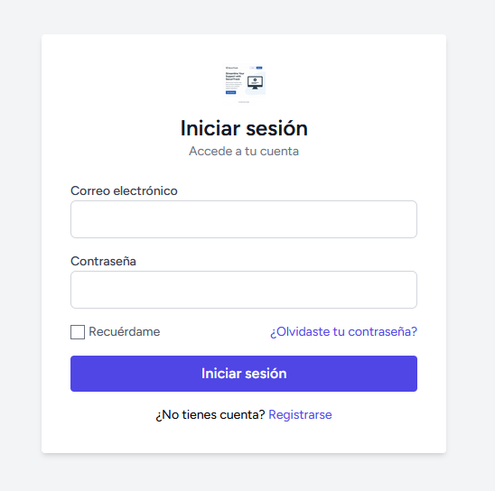
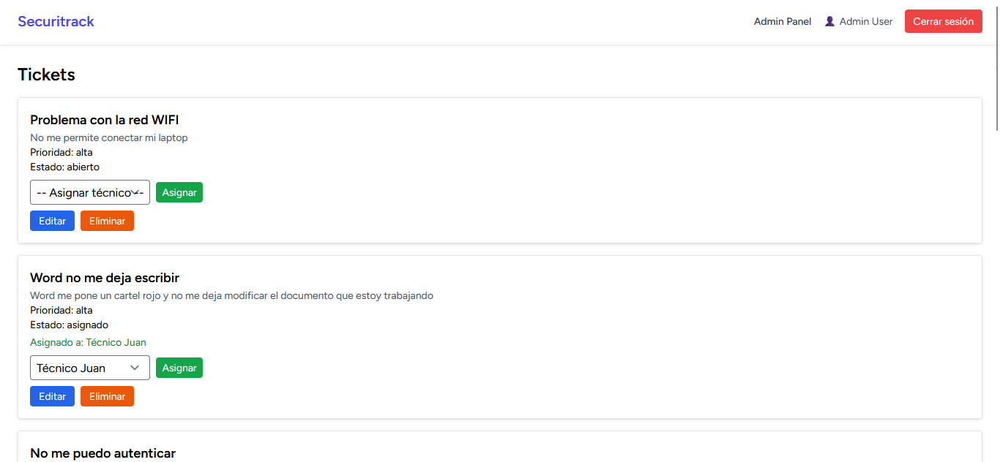
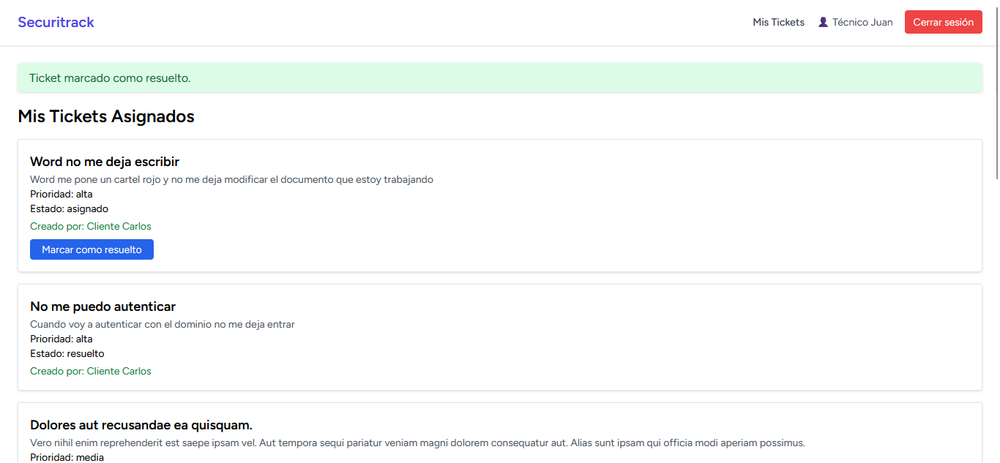
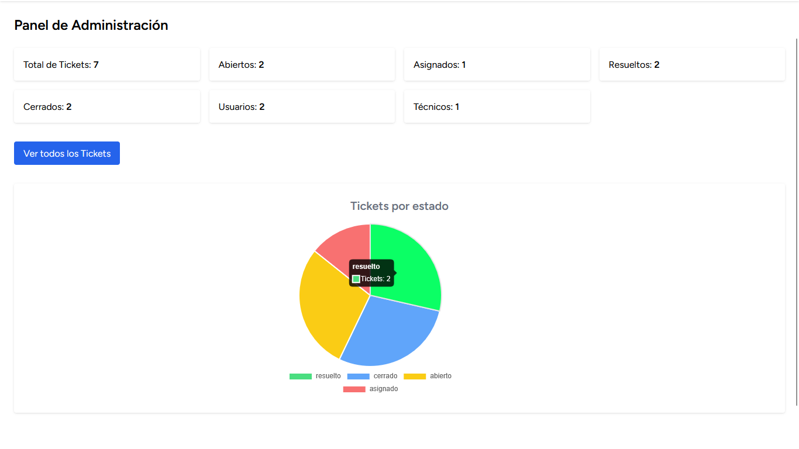
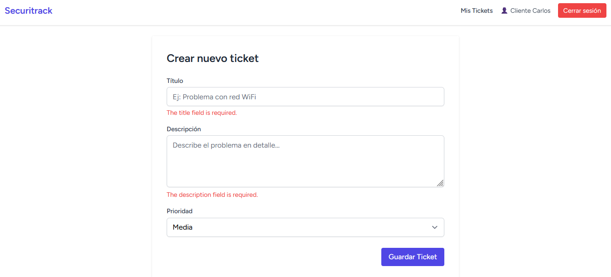

# 🎫 Ticket Management System (Laravel 11)

[](https://laravel.com)
[](https://www.php.net/)
[](LICENSE)
[](https://github.com/ericcobasdev/ticket-app-laravel)

A modern ticket management system built with Laravel 11, designed to simulate a real-world helpdesk platform with role-based access, workflow management and administrative dashboard.

This project demonstrates how to build a scalable and secure web application using Laravel, following best practices for backend architecture and full-stack integration.

---

## 🚀 Tecnologías utilizadas
- **Backend:** PHP 8.3 · Laravel 11 · MySQL
- **Frontend:** Inertia.js · Vue.js · Tailwind CSS
- **Architecture:** MVC · RESTful design
- **Gráficos:** Chart.js
- **Control de acceso:** Middleware y Policies
- **Testing:** PHPUnit · Pest

---

## ✨ Funcionalidades
- CRUD de tickets (crear, ver, editar, eliminar)
- Roles: Admin · Técnico · Usuario
- Flujo de estados: técnico resuelve → usuario cierra
- Dashboard para admins con estadísticas y gráficas
- Filtros y búsqueda avanzada
- Notificaciones por email y en-app
- Validaciones estrictas con Form Requests

---

## 🧠 Technical Highlights

- Clean MVC architecture following Laravel best practices
- Role-based authorization using middleware and policies
- FormRequest validation for cleaner controllers
- Eloquent relationships and optimized database queries
- Separation between backend (Laravel) and frontend (Vue via Inertia)
- Real-world business logic implementation

---

## 🎯 What this project demonstrates

- Full-stack application development with Laravel and Vue.js
- Authentication and role-based access control
- Implementation of real-world workflows (ticket lifecycle)
- Admin dashboard with data visualization
- Clean and maintainable backend architecture

## 📸 Capturas de pantalla



---


---


---


---



---

## 🛠️ Instalación local
```bash
# Clonar el repositorio
git clone https://github.com/ericcobasdev/ticket-app-laravel.git
cd ticket-app-laravel

# Instalar dependencias
composer install
npm install && npm run build

# Configurar variables de entorno
cp .env.example .env
php artisan key:generate

# Configurar base de datos
php artisan migrate --seed

# Iniciar servidor
php artisan serve
```

**Credenciales de prueba:**
| Rol      | Email                  | Contraseña |
|----------|------------------------|------------|
| Admin    | admin@example.com       | password   |
| Técnico  | tecnico@example.com     | password   |
| Usuario  | usuario@example.com     | password   |

---

## 🧪 Tests
```bash
php artisan test
```

---

## 📦 Deploy
Variables de entorno necesarias:
- `APP_KEY`
- `DB_*`
- `MAIL_*`
- `QUEUE_CONNECTION`

Comandos:
```bash
php artisan migrate --force
php artisan config:cache && php artisan route:cache
```

---

## 📫 Contacto
[](https://www.linkedin.com/in/ericcobas/)
[](https://github.com/ericcobasdev)

---

## 📄 Licencia
Este proyecto está bajo licencia [MIT](LICENSE).
